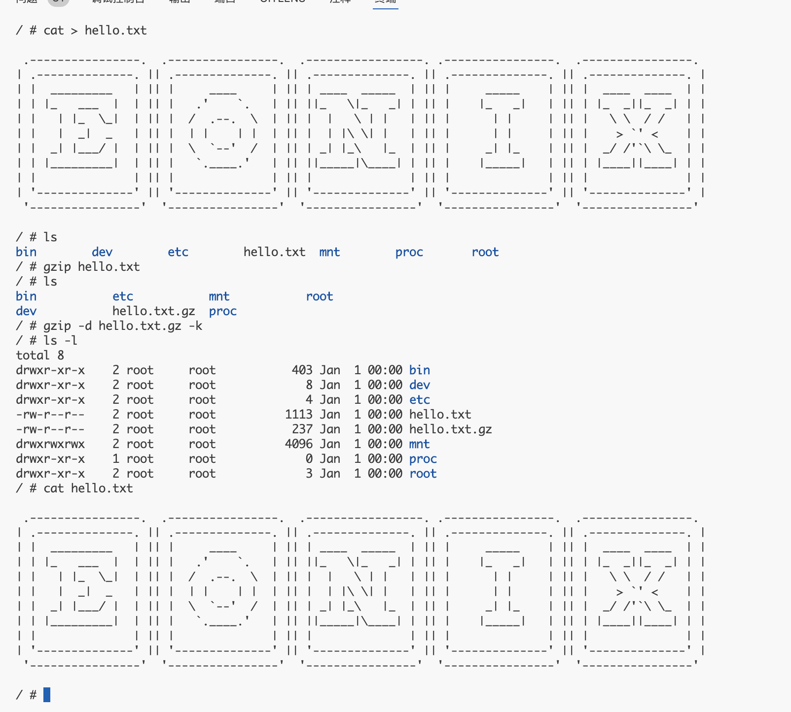

# Eonix

*Eonix* 是一个基于 *Rust* 编写的开源项目，旨在提供一个适用于多处理器多架构的宏内核操作系统。

*Eonix* 项目的目标是创建一个高效、安全、可靠的操作系统。我们的目标是提供一个简单的内核设计，使得它易于理解和维护。同时，我们也希望 *Eonix* 能够提供足够复杂的特性，如虚拟内存管理、多进程支持、*POSIX* 兼容的文件系统模型、易于使用的设备驱动开发接口等，使其拥有较强的实用性。

## 项目特性

- [x] 多处理器支持
- [x] 多架构支持（平台相关接口抽象，目前只有 x86_64 一种实现，正在加入其他架构的实现）
- [x] 内存管理
- [x] 进程管理
- [x] 文件系统
- [x] *POSIX* 兼容性，兼容 *Linux* 系统调用接口
- [x] 静态 ELF 加载器
- [x] TTY 及任务控制接口（正在进一步实现）
- [x] FAT32 文件系统的读取实现
- [ ] 全部 Rust 化（只剩一点点）
- [ ] 网卡驱动(WIP)
- [ ] POSIX 线程接口(WIP)
- [ ] 动态加载器(WIP)
- [ ] 用户、权限(WIP)

项目经测试可使用 *busybox* 中大多数功能，并且该内核使用 *busybox* 搭配 init 脚本启动，运行 *busybox* 提供的 *ash* 来执行 shell 命令。



## 初赛文档

- [启动加载](https://gitlab.eduxiji.net/T202410247994622/project2608132-275906/-/blob/master/doc/boot.md)
- [内存管理]()
- [进程管理](https://gitlab.eduxiji.net/T202410247994622/project2608132-275906/-/blob/master/doc/task.md)
- [文件系统](https://gitlab.eduxiji.net/T202410247994622/project2608132-275906/-/blob/master/doc/filesystem.md)
- [设备驱动](https://gitlab.eduxiji.net/T202410247994622/project2608132-275906/-/blob/master/doc/device_driver.md)
- [多平台支持]()

## 代码树结构

```
.
├── arch                          # 平台相关代码
│   ├── percpu-macros             # percpu变量宏
│   └── src
│       └── x86_64                # x86_64
│           ├── context.rs        # 上下文切换相关
│           ├── gdt.rs            # x86 架构 GDT相关
│           ├── init.rs           # 内核初始化相关
│           ├── interrupt.rs      # 中断相关
│           ├── io.rs             # IO 相关
│           ├── percpu.rs         # percpu 变量相关
│           └── user.rs           # 用户态相关
├── busybox                       # 默认选项编译的busybox
├── busybox-minimal               # 预编译的精简版busybox
├── configure                     # 编译准备用
├── doc                           # 开发文档
├── gblibc                        # C 标准库实现
├── gblibstdc++                   # C++ 标准库
├── include                       # C++ 头文件
├── init_script.sh                # init 进程使用的脚本文件
├── src
│   ├── boot.s                    # 启动代码
│   ├── driver
│   │   ├── ahci                  # AHCI 控制器驱动
│   │   ├── e1000e                # e1000e 网卡驱动（WIP）
│   │   └── serial.rs             # 串口驱动
│   ├── driver.rs                 # 驱动相关
│   ├── elf.rs                    # ELF 加载器
│   ├── fs
│   │   ├── fat32.rs              # FAT32 实现
│   │   ├── procfs.rs             # procfs 实现
│   │   └── tmpfs.rs              # ramfs 实现
│   ├── hash.rs                   # Hash 函数等
│   ├── intrusive_list.rs         # 侵入式链表
│   ├── io.rs                     # IO 工具类
│   ├── kernel
│   │   ├── allocator.cc          # C++ 分配器
│   │   ├── async
│   │   │   └── lock.cc           # C++ 中自旋锁
│   │   ├── block.rs              # 块设备抽象
│   │   ├── chardev.rs            # 字符设备抽象
│   │   ├── console.rs            # 内核 console 抽象
│   │   ├── constants.rs          # 常量定义
│   │   ├── cpu.rs                # CPU 状态相关
│   │   ├── hw
│   │   │   ├── acpi.cc           # ACPI 数据相关（待移除）
│   │   │   └── pci.cc            # PCI 设备相关（待移除）
│   │   ├── interrupt.rs          # 中断相关（共通）
│   │   ├── mem
│   │   │   ├── address.rs        # 虚拟地址等抽象
│   │   │   ├── mm_area.rs        # 映射区域
│   │   │   ├── mm_list
│   │   │   │   └── page_fault.rs # 处理Page Fault
│   │   │   ├── mm_list.rs        # 地址空间
│   │   │   ├── page_alloc.rs     # 页分配器
│   │   │   ├── page_table.rs     # 页表
│   │   │   ├── paging.rs         # 分页相关
│   │   │   ├── phys.rs           # 物理地址访问相关
│   │   │   └── slab.cc           # Slab 分配器
│   │   ├── smp.rs                # 多处理器相关
│   │   ├── syscall
│   │   │   ├── file_rw.rs        # 文件相关syscall
│   │   │   ├── mm.rs             # 内存相关syscall
│   │   │   ├── net.rs            # 网络相关syscall
│   │   │   ├── procops.rs        # 进程管理相关syscall
│   │   │   └── sysinfo.rs        # sys_utsname
│   │   ├── syscall.rs            # syscall相关定义
│   │   ├── task
│   │   │   ├── kstack.rs         # 内核栈操作
│   │   │   ├── process.rs        # 进程
│   │   │   ├── process_group.rs  # 进程组
│   │   │   ├── process_list.rs   # 进程列表
│   │   │   ├── scheduler.rs      # 调度器
│   │   │   ├── session.rs        # 会话
│   │   │   ├── signal.rs         # 信号处理
│   │   │   └── thread.rs         # 线程
│   │   ├── task.rs               # 任务模块
│   │   ├── terminal.rs           # 终端抽象
│   │   ├── timer.rs              # 时钟模块
│   │   ├── user
│   │   │   └── dataflow.rs       # 用户空间数据访问
│   │   ├── user.rs
│   │   └── vfs
│   │       ├── dentry
│   │       │   └── dcache.rs     # Dentry 缓存
│   │       ├── dentry.rs         # Dentry
│   │       ├── file.rs           # 打开的文件
│   │       ├── filearray.rs      # 用户的文件数组
│   │       ├── inode.rs          # Inode
│   │       ├── mount.rs          # 文件系统挂载
│   │       └── vfs.rs            # 虚拟文件系统
│   ├── kernel.ld                 # 链接脚本
│   ├── kernel.rs
│   ├── kinit.cpp            # 初始化
│   ├── lib.rs
│   ├── mbr.S                # MBR 代码
│   ├── net
│   │   └── netdev.rs        # 网络设备抽象
│   ├── path.rs              # 路径处理
│   ├── rcu.rs               # RCU 的一个临时实现
│   ├── sync
│   │   ├── condvar.rs       # 条件变量
│   │   ├── lock.rs          # 抽象锁类
│   │   ├── locked.rs        # 依赖锁变量
│   │   ├── semaphore.rs     # 信号量
│   │   ├── spin.rs          # 自旋锁
│   │   └── strategy.rs      # 锁策略
│   ├── sync.rs              # 同步模块
│   └── types
│       └── libstdcpp.cpp    # C++ 标准库用
├── user-space-program       # 测试用用户程序
└── x86_64-unknown-none.json # Rust 用 x86_64 工具链文件
```

# 编译 & 运行

## 构建依赖

#### 编译

- [GCC (测试过)](https://gcc.gnu.org/) or

- [Rust(nightly-2024-12-18)](https://www.rust-lang.org/)
- [CMake](https://cmake.org/)

#### 生成硬盘镜像

- [(Optional) busybox (项目目录下有预编译过的busybox)](https://www.busybox.net/)
- [fdisk](https://www.gnu.org/software/fdisk/)
- [mtools](http://www.gnu.org/software/mtools/)

#### 调试 & 运行

- [GDB](https://www.gnu.org/software/gdb/)
- [QEMU](https://www.qemu.org/)

## 编译及运行命令

```bash
# 配置构建环境
./configure && make prepare && make build

# 直接运行

make nativerun

# 如果需要调试

# 1: 启动调试
make srun

# 2: 启动调试器
make debug

# 或者如果有 tmux

make tmux-debug
```

可能需要在运行 `./configure` 时在环境变量中指定正确版本的构建工具。

- `QEMU`: 用于调试运行的 QEMU。默认使用 `qemu-system-x86_64`。
- `GDB`: 用于 `make debug` 的 GDB。我们将默认查找 `gdb` 或者是 `x86_64-elf-gdb` 并检查支持的架构。
- `FDISK_BIN`: 用于创建磁盘镜像分区表的 fdisk 可执行文件。默认使用 `fdisk`。

如果正在进行交叉编译，请在运行 `./configure` 时将 `CROSS_COMPILE` 设置为你的交叉编译器的相应目标三元组。

## 运行自己编译的程序

项目目录下的 `user` 目录主要是出于一些*历史*原因存在，几乎没有任何用处。所以不要尝试查看里面的内容。

要将你的程序（可以使用任何编译器为i386架构编译，静态链接）复制到构建的磁盘镜像中，你可以编辑 `CMakeLists.txt` 并在 `boot.img` 部分添加一行。你也可以尝试编辑 `init_script.sh` 以自定义启动过程。
